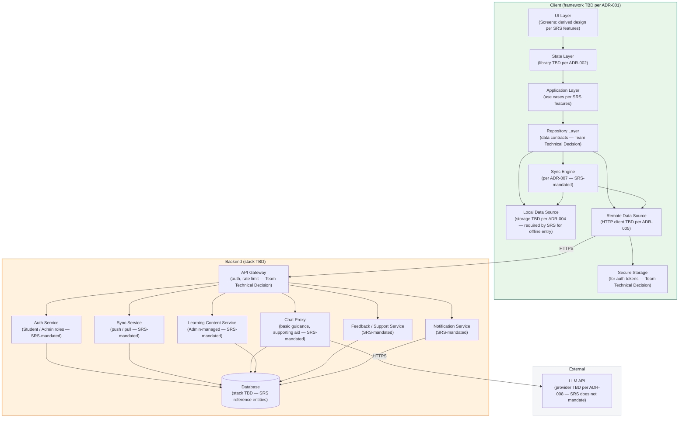

# Architecture Diagram

> **Authority:** SRS-mandated subsystems. This is a C4 Level 2 (Container) diagram.

**Critical distinction:** The diagram depicts SRS-mandated subsystems (Authentication, Sync, Chatbot, Notifications, Learning Content, Reports, Feedback/Support). Specific technologies (framework, state management, storage, HTTP, backend stack, LLM provider) are labelled `TBD` — they are `Team Technical Decision` pending ADRs. **No specific technology is presented as mandatory.**

---

## Diagram

---

## Layer Descriptions

### Client (framework TBD per ADR-001)

| Layer | Responsibility | Tag |
|-------|----------------|-----|
| UI | Render widgets for all SRS-mandated screens (screens are `Derived Design`). | `SRS Requirement` (features); `Derived Design` (screens); `TBD` (framework) |
| State | Hold UI state, dispatch to application. | `Team Technical Decision` (library TBD per ADR-002) |
| Application | Business logic for SRS-mandated features. | `SRS Requirement` (features); `Team Technical Decision` (structure) |
| Repository | Data contracts, offline-first orchestration. | `Team Technical Decision` |
| Data Source | Local DB (TBD per ADR-004) + Remote API (TBD per ADR-005). | `SRS Requirement` (offline entry); `TBD` (specific tech) |
| Sync Engine | Push pending changes; pull server-side changes. | `SRS Requirement` (offline + sync); `TBD` (specific design per ADR-007) |
| Secure Storage | Auth tokens. | `SRS Requirement` (auth); `Team Technical Decision` (storage approach) |

### Server (stack TBD)

| Service | Responsibility | Tag |
|---------|----------------|-----|
| API Gateway | Auth, rate limiting, routing. | `Team Technical Decision` |
| Auth Service | Login, role checks (Student / Admin). | `SRS Requirement` (auth, roles); `TBD` (specific design per ADR-006) |
| Sync Service | Push / pull endpoints. | `SRS Requirement` (offline + sync); `TBD` (specific design per ADR-007) |
| Chat Proxy | Basic financial guidance as supporting aid. | `SRS Requirement` (AI chatbot); `TBD` (specific design per ADR-008) |
| Content Service | Learning content (Admin-managed). | `SRS Requirement` (learning content) |
| Feedback / Support Service | Feedback submission, support query handling. | `SRS Requirement` (feedback, contact support) |
| Notification Service | Push / in-app notifications. | `SRS Requirement` (notifications) |

### External

| System | Purpose | Tag |
|--------|---------|-----|
| LLM API | Powers the AI chatbot. Provider TBD per ADR-008. | `SRS Requirement` (chatbot); `TBD` (provider) |

---

## Key Properties

- **Cross-platform compatibility** (SRS-mandated): the client builds for multiple platforms. `SRS Requirement`
- **Role-based access** (SRS-mandated): Student vs Admin enforced server-side. `SRS Requirement`
- **Offline-first** (SRS-mandated): local DB stores offline entries; sync engine pushes when online. `SRS Requirement`
- **AI chatbot as supporting aid** (SRS-mandated): the chatbot provides basic financial guidance, not a substitute. `SRS Requirement`
- **Specific technologies** (TBD): framework, state management, storage, HTTP, backend stack, LLM provider are all `Team Technical Decision` pending ADRs.

---

## What This Diagram Does NOT Show

- **Internal class structure** → `../architecture/TECHNICAL_DESIGN.md`
- **Data model** → `../architecture/DATABASE_DESIGN.md` and `ER_DIAGRAM.md`
- **Deployment topology** → `DEPLOYMENT.md`

---

**Last updated:** Source-accuracy audit
**Maintained by:** Team
**Status:** `Audited` — SRS-mandated subsystems depicted; specific technologies labelled TBD pending ADRs
