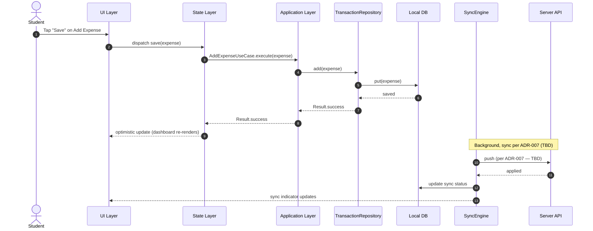
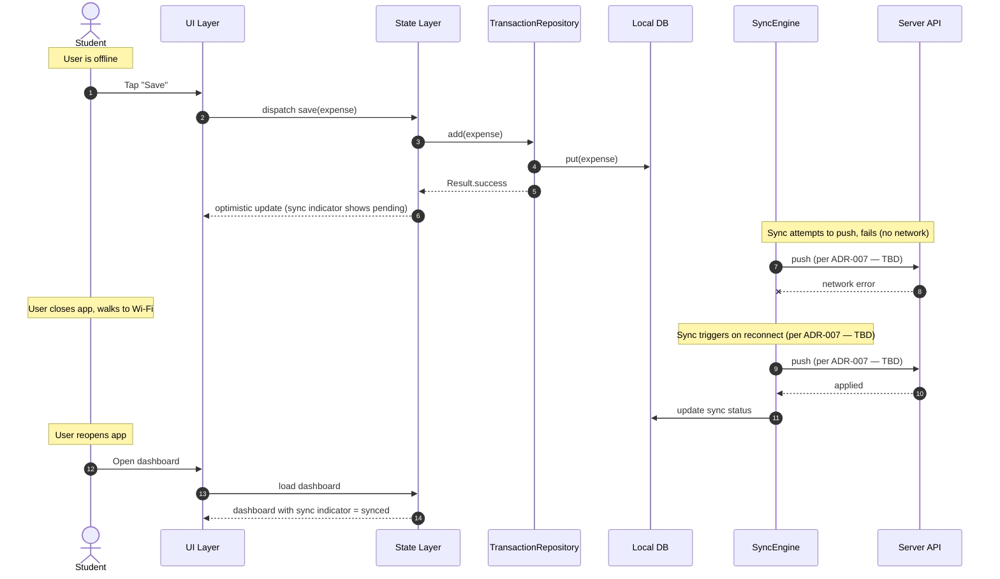
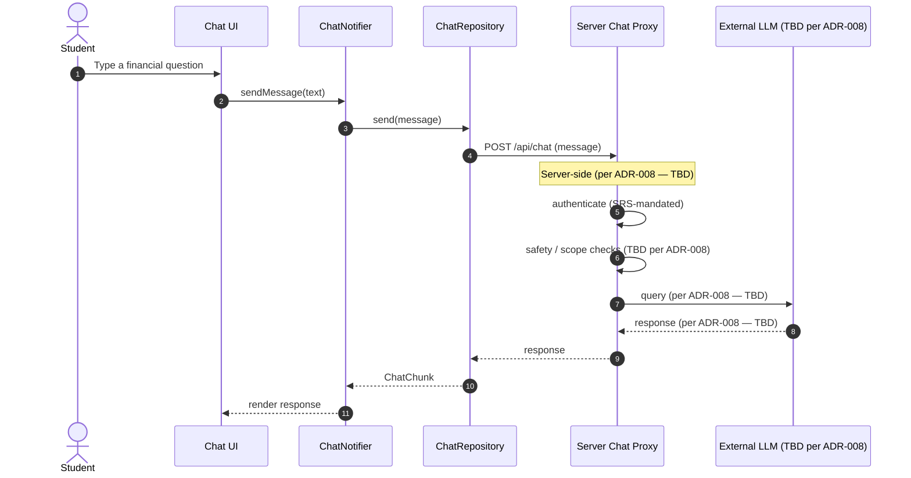
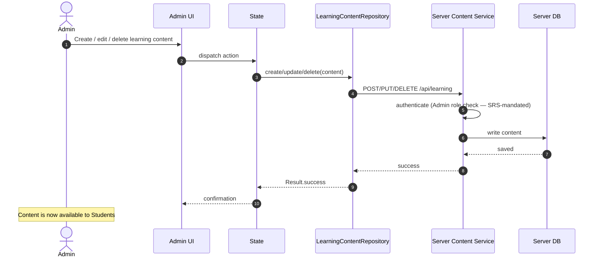
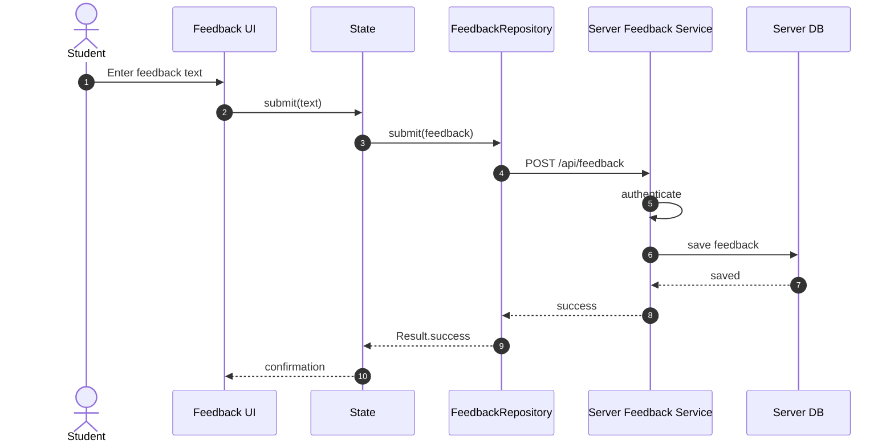

# Data Flow Diagram

> **Authority:** SRS-mandated features. This document shows step-by-step data flows for the most important PennyPal operations, as sequence diagrams.

**Critical distinction:** The flows themselves are `Derived Design` (the team's design to satisfy SRS-mandated capabilities). Specific implementation details (queue, conflict resolution, prompt architecture) are `TBD` pending ADRs. **No specific implementation is invented.**

---

## Data Flow Inventory

| Flow ID | Flow name | Traces to SRS feature | Status |
|---------|-----------|------------------------|--------|
| DF-01 | Add Expense (online) | F-03 Income and expenses | `Audited` |
| DF-02 | Add Expense (offline) + Sync | F-14 Offline + sync | `Audited` |
| DF-03 | AI Chatbot Query | F-11 AI chatbot | `Audited` |
| DF-04 | Admin Manages Learning Content | F-08 Learning content (Admin) | `Audited` |
| DF-05 | Submit Feedback | F-09 Feedback | `Audited` |

---

## DF-01: Add Expense (online)

**Key points:**
- The UI updates optimistically (SRS-mandated expense recording). `SRS Requirement`
- Sync runs in the background. `SRS Requirement` (sync mandated); specific mechanism `TBD` per ADR-007.

---

## DF-02: Add Expense (offline) + Sync

**Key points (SRS-mandated):**
- User can create expense entries while offline. `SRS Requirement`
- Offline entries synchronize when connectivity returns. `SRS Requirement`
- Pending changes survive app kill (per team design in ADR-007). `Team Technical Decision`
- Specific sync mechanism is `TBD` per ADR-007. **No specific algorithm is invented.**

---

## DF-03: AI Chatbot Query

**Key points (SRS-mandated):**
- The system provides an AI chatbot. `SRS Requirement`
- The chatbot provides basic financial guidance as supporting aid, not a substitute. `SRS Requirement`
- Specific LLM provider, prompt architecture, safety filtering: `Team Technical Decision` per ADR-008. **No specific design is invented.**

---

## DF-04: Admin Manages Learning Content

**Key points:**
- Admin manages learning content. `SRS Requirement` (Admin role; learning content feature).
- Admin role check enforced server-side. `SRS Requirement`

---

## DF-05: Submit Feedback

**Key points (SRS-mandated):**
- The system allows users to submit feedback. `SRS Requirement`

---

**Last updated:** Source-accuracy audit
**Maintained by:** Team
**Status:** `Audited` — flows are `Derived Design`; specific implementation details `TBD` pending ADRs
