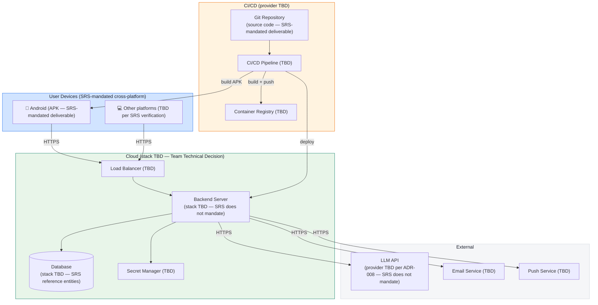

# Deployment Diagram

> **Authority:** SRS-mandated cross-platform compatibility and submission deliverables (APK, source code, README, MP4).

**Critical distinction:** The SRS mandates cross-platform compatibility and the APK / source code / README / MP4 deliverables. Specific deployment topology, backend stack, CI/CD provider, and external services are `Team Technical Decision` or `TBD`. **No specific technology is presented as mandatory.**

---

## Diagram

---

## Component Descriptions

### User Devices

**`SRS Requirement`** — cross-platform compatibility is mandated.

| Platform | Distribution | SRS section / tag |
|----------|--------------|-------------------|
| Android | APK (`SRS Requirement` — APK is a mandated deliverable) | `SRS Requirement` |
| Other platforms (iOS, Web, Desktop) | `[TBD]` | `Assumption` — pending SRS verification |

### Cloud

**Tag:** `TBD` — pending backend stack decision. The SRS does not mandate a specific cloud provider or backend stack.

| Component | Tech | Tag |
|-----------|------|-----|
| Load Balancer | `[TBD]` | `Team Technical Decision` |
| Backend Server | `[TBD]` | `Team Technical Decision` |
| Database | `[TBD]` (SRS reference entities are `SRS Requirement`; specific DB tech is `TBD`) | `SRS Requirement` (entities); `TBD` (tech) |
| Secret Manager | `[TBD]` | `Team Technical Decision` |

### External Services

| Service | Purpose | Tag |
|---------|---------|-----|
| LLM API | Powers the AI chatbot (F-11). Provider TBD per ADR-008. | `SRS Requirement` (chatbot); `TBD` (provider) |
| Email Service | For support / notification emails. | `Assumption` — pending SRS verification |
| Push Service | For push notifications (F-12). | `TBD` |

### CI/CD

| Component | Purpose | Tag |
|-----------|---------|-----|
| Git Repository | Hosts source code (`SRS Requirement` — source code is a mandated deliverable). | `SRS Requirement` |
| CI/CD Pipeline | Builds APK, runs tests, deploys backend. | `Team Technical Decision` |
| Container Registry | Hosts backend container image. | `Team Technical Decision` |

---

## Environments

**Tag:** `Team Technical Decision` — `TBD`.

| Env | Backend URL | Purpose | Tag |
|-----|-------------|---------|-----|
| `development` | `[TBD]` | Local dev. | `Team Technical Decision` |
| `staging` | `[TBD]` | Pre-production. | `Team Technical Decision` |
| `production` | `[TBD]` | Submission. | `Team Technical Decision` |

---

## Build & Release Process

The SRS mandates the following deliverables. The release runbook must produce all of them.

| Deliverable | Build process | Tag |
|-------------|---------------|-----|
| APK | Built from source; signed. | `SRS Requirement` |
| Source code | Pushed to Git repository. | `SRS Requirement` |
| README | Committed to repository root. | `SRS Requirement` |
| MP4 demonstration | Recorded from running app. | `SRS Requirement` |
| Credentials | Documented for judges. | `SRS Requirement` |

Detailed build process: `../process/DEPLOYMENT.md`.

---

## Security Notes

**`TBD`** — pending `../architecture/SECURITY.md` completion.

---

## Limitations

**`TBD`** — pending architectural decisions. See `../LIMITATIONS.md`.

---

**Last updated:** Source-accuracy audit
**Maintained by:** Team
**Status:** `Audited` — SRS-mandated deliverables depicted; specific technologies labelled TBD
