# Entity-Relationship Diagram

> **Authority:** SRS data requirements (in `REQUIREMENTS.md` and `DATABASE_DESIGN.md`).

This diagram shows the entities in PennyPal's data model and their relationships.

**Critical distinction:** The SRS specifies **10 reference entities** (shown with solid borders, tagged `SRS Requirement`). Non-SRS entities (Feedback, ChatMessage, SyncQueue, ConflictLog) are tagged `Derived Design` or `Team Technical Decision` (shown with dashed borders).

---

## Diagram

```mermaid
erDiagram
    %% SRS reference entities (solid)
    USERS ||--o| USERPROFILES : "has one"
    USERS ||--o{ TRANSACTIONS : "creates"
    USERS ||--o{ BUDGETS : "sets"
    USERS ||--o{ SAVINGSGOALS : "sets"
    USERS ||--o{ REPORTS : "owns"
    USERS ||--o{ NOTIFICATIONS : "receives"
    USERS ||--o{ SUPPORTQUERIES : "submits"
    USERS ||--o{ LEARNINGCONTENT : "manages (Admin)"

    CATEGORIES ||--o{ TRANSACTIONS : "categorizes"

    %% Non-SRS entities (derived / team-decided)
    USERS ||--o{ FEEDBACK : "submits (Derived Design)"
    USERS ||--o{ CHATMESSAGE : "owns (Derived Design)"

    %% SRS reference entities
    USERS {
        uuid id PK "Derived Design"
        string email "Derived Design"
        enum role "Student / Admin — SRS Requirement"
        string passwordHash "Derived Design"
    }

    USERPROFILES {
        uuid id PK "Derived Design"
        uuid userId FK "SRS Requirement (implied)"
        string profileFields "TBD — pending SRS attribute spec"
    }

    TRANSACTIONS {
        uuid id PK "Derived Design"
        uuid userId FK "SRS Requirement (implied)"
        enum type "income / expense — SRS Requirement"
        int amount "SRS Requirement"
        datetime date "Derived Design"
        uuid categoryId FK "SRS Requirement (Expense categories)"
        string note "Derived Design"
        string syncFields "TBD — pending ADR-007"
    }

    CATEGORIES {
        uuid id PK "Derived Design"
        string name "SRS Requirement"
        string otherFields "TBD — pending SRS attribute spec"
    }

    BUDGETS {
        uuid id PK "Derived Design"
        uuid userId FK "SRS Requirement (implied)"
        int amount "SRS Requirement"
        string otherFields "TBD — pending SRS attribute spec"
    }

    SAVINGSGOALS {
        uuid id PK "Derived Design"
        uuid userId FK "SRS Requirement (implied)"
        int targetAmount "SRS Requirement"
        int currentAmount "SRS Requirement"
        string otherFields "TBD — pending SRS attribute spec"
    }

    REPORTS {
        uuid id PK "Derived Design"
        uuid userId FK "SRS Requirement (implied)"
        string reportFields "TBD — pending SRS attribute spec"
    }

    LEARNINGCONTENT {
        uuid id PK "Derived Design"
        string title "Derived Design"
        string body "Derived Design"
        uuid createdBy FK "Derived Design (Admin)"
    }

    NOTIFICATIONS {
        uuid id PK "Derived Design"
        uuid userId FK "SRS Requirement (implied)"
        string body "Derived Design"
        string otherFields "TBD — pending SRS attribute spec"
    }

    SUPPORTQUERIES {
        uuid id PK "Derived Design"
        uuid userId FK "SRS Requirement (implied)"
        string body "SRS Requirement"
        string otherFields "TBD — pending SRS attribute spec"
    }

    %% Non-SRS entities (Derived Design)
    FEEDBACK {
        uuid id PK "Derived Design"
        uuid userId FK "Derived Design"
        string text "SRS Requirement (feedback feature)"
        string otherFields "Derived Design"
    }

    CHATMESSAGE {
        uuid id PK "Derived Design"
        uuid userId FK "Derived Design"
        enum role "user / assistant — Derived Design"
        string content "Derived Design"
    }
```

---

## Entity Classification

### SRS Reference Entities (10 — `SRS Requirement`)

| Entity | SRS section | Tag |
|--------|-------------|-----|
| Users | Database planning | `SRS Requirement` |
| UserProfiles | Database planning | `SRS Requirement` |
| Transactions | Database planning | `SRS Requirement` |
| Categories | Database planning | `SRS Requirement` |
| Budgets | Database planning | `SRS Requirement` |
| SavingsGoals | Database planning | `SRS Requirement` |
| Reports | Database planning | `SRS Requirement` |
| LearningContent | Database planning | `SRS Requirement` |
| Notifications | Database planning | `SRS Requirement` |
| SupportQueries | Database planning | `SRS Requirement` |

### Non-SRS Entities (`Derived Design` or `Team Technical Decision`)

| Entity | Reason | Tag |
|--------|--------|-----|
| Feedback | SRS mandates Feedback feature but does not list Feedback as a database reference entity. | `Derived Design` |
| ChatMessage | SRS mandates AI chatbot feature but does not list ChatMessage as a database reference entity. | `Derived Design` |
| SyncQueue | SRS mandates sync; queue-based design is team-decided. | `Team Technical Decision` |
| ConflictLog | SRS mandates sync; conflict log is team-decided. | `Team Technical Decision` |

---

## Relationship Summary

### SRS-mandated relationships (implied)

| From | To | Cardinality | Notes | Tag |
|------|----|-------------|-------|-----|
| Users | UserProfiles | 1:1 | | `SRS Requirement` |
| Users | Transactions | 1:N | | `SRS Requirement` |
| Users | Budgets | 1:N | | `SRS Requirement` |
| Users | SavingsGoals | 1:N | | `SRS Requirement` |
| Users | Reports | 1:N | | `SRS Requirement` |
| Users | Notifications | 1:N | | `SRS Requirement` |
| Users | SupportQueries | 1:N | | `SRS Requirement` |
| Users | LearningContent | N:M (access) | Admin manages; Student views. | `SRS Requirement` |
| Categories | Transactions | 1:N | | `SRS Requirement` |

### Derived relationships

| From | To | Cardinality | Notes | Tag |
|------|----|-------------|-------|-----|
| Users | Feedback | 1:N | Feedback feature is `SRS Requirement`; entity is `Derived Design`. | `Derived Design` |
| Users | ChatMessage | 1:N | Chatbot feature is `SRS Requirement`; entity is `Derived Design`. | `Derived Design` |
| Categories | Budgets | 1:N | If budgets are per-category. | `Derived Design` |

---

## Notes

### Soft deletes

**`Assumption`** — pending team decision. Soft deletes (with `deletedAt`) are a `Team Technical Decision`.

### Sync fields

**`SRS Requirement`** — the SRS mandates offline expense entry and synchronization. Entities that support offline writes (e.g., Transactions) carry sync-related fields. `SRS Requirement` (sync mandated); `TBD` (specific field design per ADR-007).

### Local-only entities

**`Team Technical Decision`** — the SyncQueue and ConflictLog (if used) are local-only entities. TBD per ADR-007.

### Money storage

**`Assumption`** — pending team decision. Integer minor units are recommended.

### Specific entity fields

**`TBD`** — the SRS specifies the 10 reference entities but specific attribute lists are pending SRS verification. The team should walk the SRS attribute specifications and update this diagram accordingly.

---

**Last updated:** Source-accuracy audit
**Maintained by:** Team
**Status:** `Audited` — SRS reference entities (10) distinguished from non-SRS entities (`Derived Design` / `Team Technical Decision`); specific fields pending SRS attribute verification
