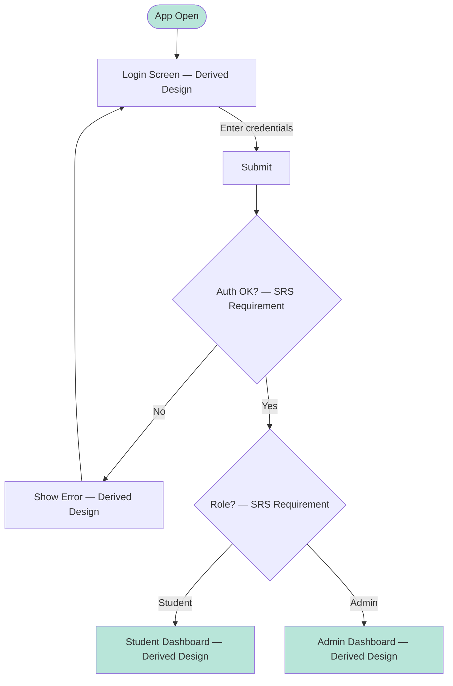
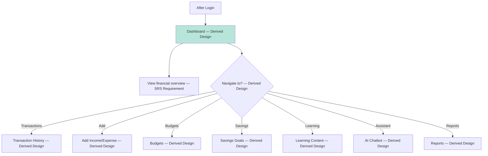
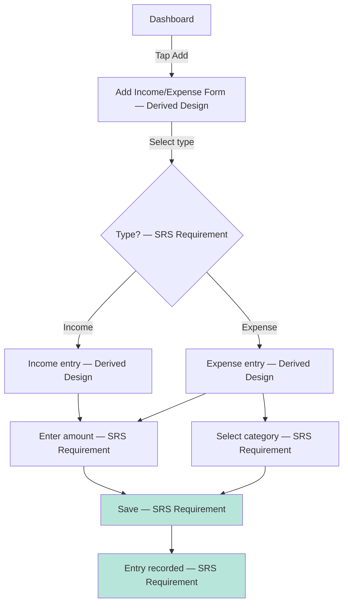
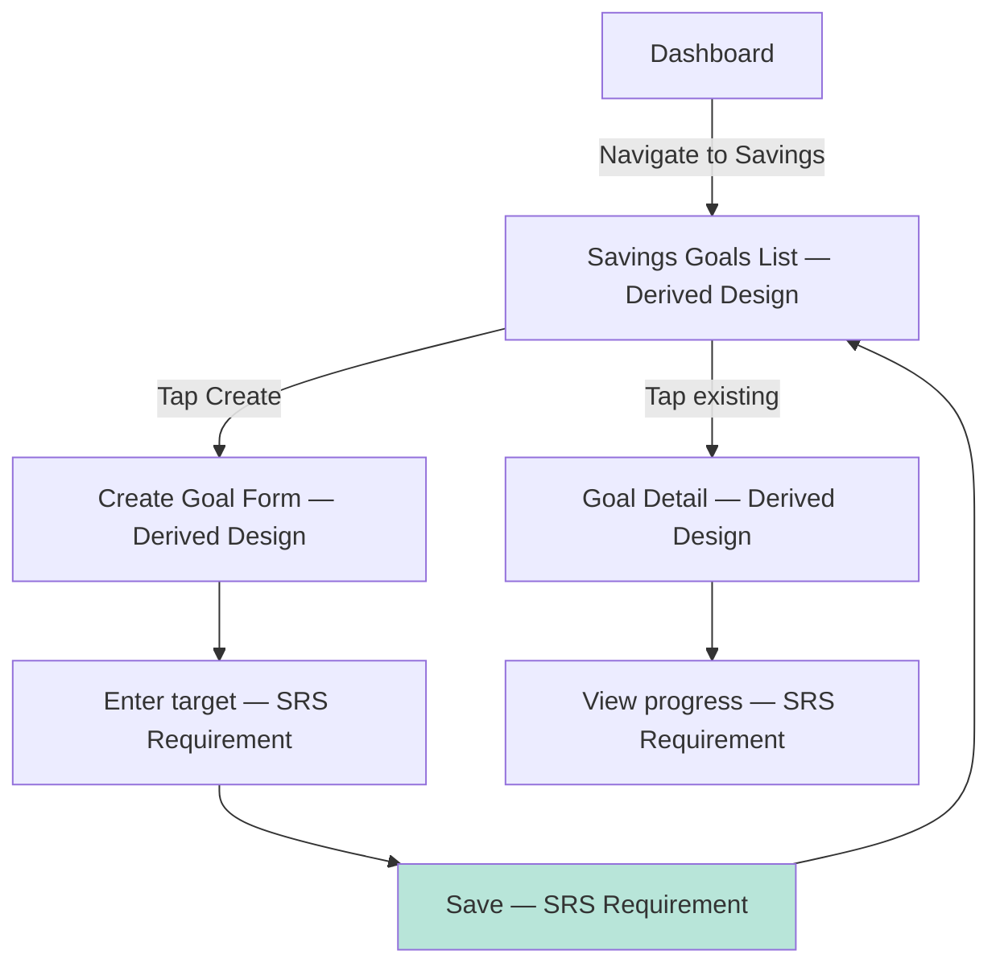
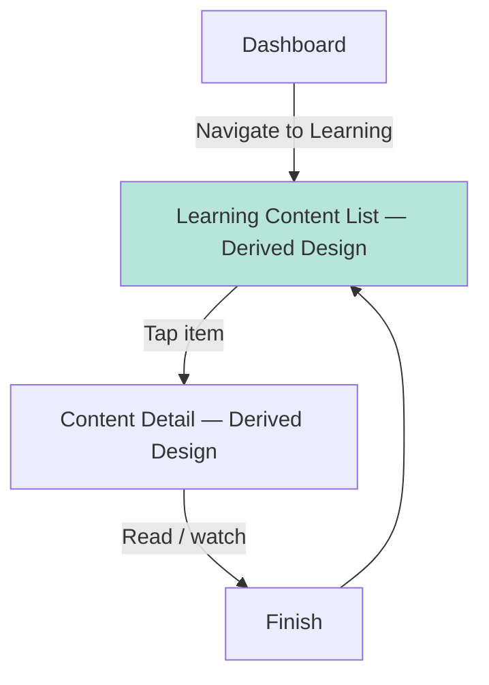
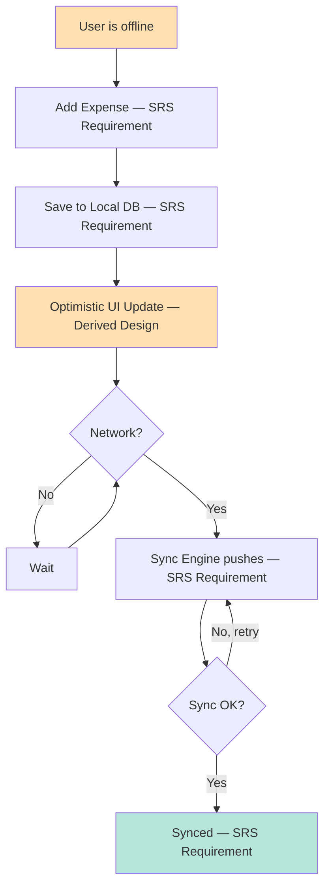

# User Flow Diagram

> **Authority:** SRS-mandated features and use cases. This document shows the primary user flows as flowcharts. For detailed step-by-step descriptions, see `../design/USER_FLOWS.md`.

**Critical distinction:** The flows themselves are `Derived Design` (the team's design to satisfy SRS-mandated capabilities). Specific UI steps are `Derived Design`. SRS-mandated capabilities are tagged `SRS Requirement`.

---

## Flow Inventory

| Flow ID | Flow name | Traces to SRS feature | Status |
|---------|-----------|------------------------|--------|
| UF-01 | Login | F-01 Authentication | `Audited` |
| UF-02 | Dashboard | F-02 Dashboard | `Audited` |
| UF-03 | Add Income/Expense | F-03 Income and expenses | `Audited` |
| UF-06 | Budget | F-06 Budgets | `Audited` |
| UF-07 | Savings Goal | F-07 Savings goals | `Audited` |
| UF-08 | Learning Content | F-08 Learning content | `Audited` |
| UF-11 | AI Chatbot | F-11 AI chatbot | `Audited` |
| UF-14 | Offline Expense + Sync | F-14 Offline + sync | `Audited` |

---

## UF-01: Login (Student / Admin)



`SRS Requirement` — authentication and role-based access are SRS-mandated. Specific screens are `Derived Design`.

---

## UF-02: Dashboard



`SRS Requirement` — Dashboard is SRS-mandated. Specific contents are `Derived Design`.

---

## UF-03: Add Income/Expense



`SRS Requirement` — income and expense entry is SRS-mandated. Specific form is `Derived Design`.

---

## UF-06: Budget


`SRS Requirement` — budgets are SRS-mandated.

---

## UF-07: Savings Goal



`SRS Requirement` — savings goals are SRS-mandated.

---

## UF-08: Learning Content



`SRS Requirement` — learning content is SRS-mandated.

---

## UF-11: AI Chatbot

```mermaid
flowchart TD
    Dashboard[Dashboard] -->|Tap Assistant| ChatScreen[Chat Screen — Derived Design]
    ChatScreen -->|Type question| SendMessage[Send — SRS Requirement]
    SendMessage --> ServerCall[Server-side processing — TBD per ADR-008]
    ServerCall --> SafetyCheck{Within scope? — SRS Requirement (supporting aid only)}
    SafetyCheck -->|No — regulated advice| SafetyMsg[Decline; suggest professional — SRS Requirement]
    SafetyCheck -->|Yes — basic guidance| StreamResponse[Provide basic guidance — SRS Requirement]
    StreamResponse --> ShowResponse[Show response — Derived Design]
    ShowResponse --> ChatScreen

    style SendMessage fill:#B8E5D9
    style SafetyMsg fill:#FFCDD2
```

`SRS Requirement` — AI chatbot is SRS-mandated; it provides basic financial guidance as supporting aid, not a substitute. Specific integration is `TBD` per ADR-008.

---

## UF-14: Offline Expense + Sync



`SRS Requirement` — offline expense entry and synchronization are SRS-mandated. Specific sync mechanism is `TBD` per ADR-007.

---

## Combined Primary Flow Map

```mermaid
flowchart LR
    Auth[Login — SRS Requirement] --> Dashboard[Dashboard — SRS Requirement]
    Dashboard --> Txns[Transactions — SRS Requirement]
    Dashboard --> Budgets[Budgets — SRS Requirement]
    Dashboard --> Savings[Savings — SRS Requirement]
    Dashboard --> Learning[Learning — SRS Requirement]
    Dashboard --> Assistant[AI Assistant — SRS Requirement]
    Dashboard --> Reports[Reports — SRS Requirement]
    Dashboard --> Feedback[Feedback — SRS Requirement]
    Dashboard --> Support[Support — SRS Requirement]
    Dashboard --> Notifications[Notifications — SRS Requirement]

    Txns --> AddTxn[Add Income/Expense — SRS Requirement]
    AddTxn --> SyncBackground[Background Sync — SRS Requirement]
    SyncBackground --> Dashboard

    Assistant --> AskQ[Ask Question — SRS Requirement]
    AskQ --> ShowResp[Show Basic Guidance — SRS Requirement (supporting aid)]

    Admin[Admin Login — SRS Requirement] --> AdminPanel[Admin Panel — Derived Design]
    AdminPanel --> ContentMgmt[Content Mgmt — SRS Requirement]
    AdminPanel --> FeedbackReview[Feedback Review — SRS Requirement]
    AdminPanel --> SupportHandling[Support Handling — SRS Requirement]
    AdminPanel --> UserMgmt[User Mgmt — SRS Requirement]

    style Auth fill:#D1E4FF
    style Admin fill:#D1E4FF
    style Dashboard fill:#B8E5D9
    style SyncBackground fill:#FFE0B2
```

---

**Last updated:** Source-accuracy audit
**Maintained by:** Team
**Status:** `Audited` — flows are `Derived Design`; SRS-mandated capabilities tagged `SRS Requirement`
